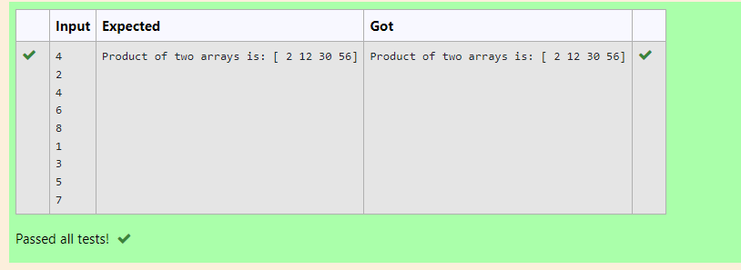

# Multiplying-two-matrix


## AIM:
To write a python program to multiply two arrays using numpy.

## ALGORITHM:
### Step 1:
Import the numpy as np.

### Step 2:
Create a two list and enter the count of the array.

### Step 3:
Using the for loop append the entries in two lists.

### Step 4:
After add the all values multiply the two lists.

### Step 5:
Print the product of the two array.

## PROGRAM:
```
#Developed by: Paul Andrew D
#Reference no.: 21500230

import numpy as np
list1, list2 = [],[]
num= int(input())
for i in range(num):
    list1.append(int(input()))
for i in range(num):
    list2.append(int(input()))
value1= np.array(list1)
value2 = np.array(list2)
result = value1*value2
print("Product of two arrays is:",result)
``` 

## OUTPUT:


## RESULT:
The above program is successfully to multiply two arrays using numpy.